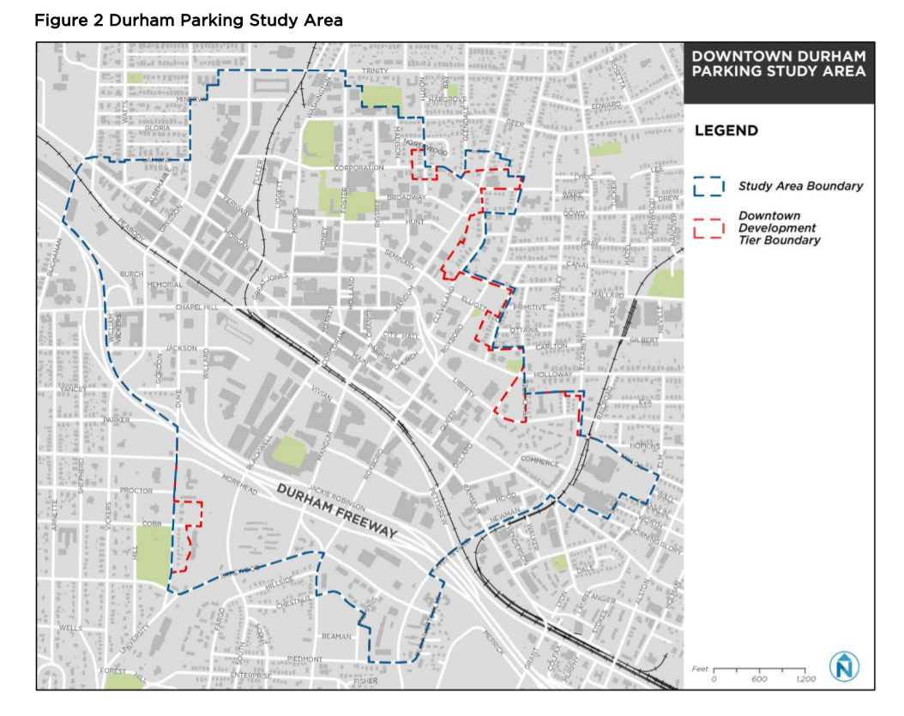

Using the [Downtown Durham Parking Study](https://www.parkdurham.org/DocumentCenter/View/119/Durham-Final-Report--Action-Plan-PDF "DDPS") 2018 total parking data and capacity was collected. Future projections are based off employment growth and the distribution from the Visitor category to trip purposes is based off peak trip attraction share, mirroring the previous methodology. 


**Methodology**

The Downtown Durham parking Study (DDPS) only looked at a portion of the Durham PASA area. 



Total parking spaces from the DDPS equalled 10,637 after factoring out residential trips and only including those spots within the Durham PASA.  The table below shows the existing 2013, 2016, 2025 and 2045 parking space data for Durham's PASA, along with the updated 2018 data from the DDPS. The total 10,637 parking spaces were distributed to Work and Visitor categories by keeping the 2016 distribution between the two categories constant (62% work and 38% visitor), then calibrating to finally equal the final base year distribution of 8,000 worker spaces and 2,637 visitor spaces. 

Capacity to worker space ratio = 1.4
Capacity to visitor space ratio = 6.0

Annual simplified growth factors for both work (total employment) and visitor (service + retail), future scenarios are projected. This scenario assumes double work parking spots by 2050 and triple visitor parking spaces by 2050. Scenarios are factored in 2020, 2030 and 2040 scenarios to the ultimate 2050 goal. 


```{r, echo=FALSE, message=FALSE, warning=FALSE, results='hide'}
##load data

library(xlsx)
library(readxl)
library(plotly)
library(sf)
library(dplyr)
library(tidygeocoder)
library(leaflet)
library(rgdal)
library(dplyr)
library(rmarkdown)
library(crosstalk)
library(lubridate)
library(htmltools)
library(remotes)
SE_2013 <- tcadr::read_tcad("C:/Users/JacobFo/OneDrive - City of Durham/SE_2013-rev.bin")
SE_2016<- tcadr::read_tcad ("SE_2016.BIN")

SE_2025 <- tcadr::read_tcad("C:/Users/JacobFo/OneDrive - City of Durham/MTP Work/TRM SE Data Inputs/2025/SE_2025.bin")

SE_2045 <- tcadr::read_tcad("C:/Users/JacobFo/OneDrive - City of Durham/MTP Work/TRM SE Data Inputs/2045/SE_2045.bin")


Stud_Off_2045 <- tcadr::read_tcad("C:/Users/JacobFo/OneDrive - City of Durham/MTP Work/TRM MTP Inputs Scenario Years/2045 MTP wAmendments/Input/Univ/Stud_Off Total 2045.bin")


library(dplyr)

SE_2016_sum <- SE_2016 %>%
  group_by(PASA) %>%
  summarize(n = n(),
            work = sum(Industry + Office + Service_RateLow + Service_RateHigh + Retail),
            vistor = sum(Service_RateLow + Service_RateHigh + Retail))

SE_2025_sum <- SE_2025 %>%
  group_by(PASA) %>%
  summarize(n = n(),
            work = sum(Industry + Office + Service_RateLow + Service_RateHigh + Retail),
            vistor = sum(Service_RateLow + Service_RateHigh + Retail))


SE_2045_sum <- SE_2045 %>%
  group_by(PASA) %>%
  summarize(n = n(),
            work = sum(Industry + Office + Service_RateLow + Service_RateHigh + Retail),
            vistor = sum(Service_RateLow + Service_RateHigh + Retail))

SE_2045_sum$University <- NA

SE_2045_sum$University[2] <- sum(Stud_Off_2045$UNC)
SE_2045_sum$University[3] <- sum(Stud_Off_2045$DUKE)
SE_2045_sum$University[4] <- sum(Stud_Off_2045$NCSU)
SE_2045_sum$University[5] <- sum(Stud_Off_2045$NCCU)

SE_2045_sum=SE_2045_sum[-1,]


###Add Park Capcity files
ParkCap_2013 <- tcadr::read_tcad("C:/Users/JacobFo/OneDrive - City of Durham/MTP Work/TRM MTP Inputs Scenario Years/2013 Base Year/Input/Programs/Parkcap.bin")
ParkCap_2016 <- tcadr::read_tcad("C:/Users/JacobFo/TRMv6.2/Original TRMv6.2_2016/Input/Programs/Parkcap.bin")
ParkCap_2025 <- tcadr::read_tcad("C:/Users/JacobFo/OneDrive - City of Durham/MTP Work/TRM MTP Inputs Scenario Years/2025 MTP wAmendments/Input/Programs/Parkcap.bin")
ParkCap_2035 <- tcadr::read_tcad("C:/Users/JacobFo/OneDrive - City of Durham/MTP Work/TRM MTP Inputs Scenario Years/2035 MTP wAmendments/Input/Programs/Parkcap.bin")
ParkCap_2045 <- tcadr::read_tcad("C:/Users/JacobFo/OneDrive - City of Durham/MTP Work/TRM MTP Inputs Scenario Years/2045 MTP wAmendments/Input/Programs/Parkcap.bin")

ParkCap_2013$Year <- 2013
ParkCap_2016$Year <- 2016
ParkCap_2025$Year <- 2025
ParkCap_2035$Year <- 2035
ParkCap_2045$Year <- 2045

All_Caps <- rbind(ParkCap_2013, ParkCap_2016, ParkCap_2025, ParkCap_2035, ParkCap_2045)

labels = c("1 = UNC Campus",
"2 = Duke Campus",
"3 = NCSU Campus",
"4 = NCCU Campus",
"5 = Chapel Hill CBD",
"6 = Durham CBD",
"7 = Raleigh CBD",
"8 = Carrboro CBD",
"9 = Hillsborough CBD",
"10=RDU"


)

levels = c(1,2,3,4,5,6,7,8,9,10)

All_Caps$PASA <- ordered(All_Caps$PASA,
                         levels=levels,
                         labels=labels)

library(lubridate)

lubridate::ymd(All_Caps$Year, truncated=2L)

All_Caps$Tot_Cap <- All_Caps$CapHBW + All_Caps$CapHBO + All_Caps$CapHBSH + All_Caps$CapHBU + All_Caps$CapNHNW +All_Caps$CapWBNH 

library(readxl)
parkingspaces <-read_excel("parkingspaces.xlsx")
```


**Parking Spaces**


```{r, echo=FALSE, message=FALSE, warning=FALSE}
library(dplyr)
durham_spaces <- parkingspaces %>%
  filter(parkingspaces$PASA == '6 = Durham CBD*')


durham_spaces <- add_row(durham_spaces, PASA= "6 = Durham CBD*", Year = 2018, Total =10637, Work = durham_spaces$Total[durham_spaces$Year==2018]  )

durham_spaces[,-1] <- round(durham_spaces[,-1], digits=0)

durham_spaces <- add_row(durham_spaces, PASA= "Durham Updated BY", Year = 2018, Total =10637, Work = 8000, Visitors = 2637)

library(DT)
durham_spaces[,-1] <- round(durham_spaces[,-1], digits=0)
datatable(durham_spaces)
```

**Parking Spaces -> Parking Capacity**


Add the factoring of 1.4 for work spaces and 6 for visitors: 


```{r, echo=FALSE, message=FALSE, warning=FALSE, results='hide'}
durham_spaces$Capacity <- NA

durham_spaces$Capacity[1] <- ParkCap_2013$CapHBW[ParkCap_2013$PASA==6] + ParkCap_2013$CapHBO[ParkCap_2013$PASA==6]+ ParkCap_2013$CapHBSH[ParkCap_2013$PASA==6]+ ParkCap_2013$CapNHNW[ParkCap_2013$PASA==6]+ ParkCap_2013$CapWBNH[ParkCap_2013$PASA==6]

durham_spaces$Capacity[2] <- ParkCap_2016$CapHBW[ParkCap_2016$PASA==6] + ParkCap_2016$CapHBO[ParkCap_2016$PASA==6]+ ParkCap_2016$CapHBSH[ParkCap_2016$PASA==6]+ ParkCap_2016$CapNHNW[ParkCap_2016$PASA==6]+ ParkCap_2016$CapWBNH[ParkCap_2016$PASA==6]

durham_spaces$Capacity[3] <-ParkCap_2025$CapHBW[ParkCap_2025$PASA==6] + ParkCap_2025$CapHBO[ParkCap_2025$PASA==6]+ ParkCap_2025$CapHBSH[ParkCap_2025$PASA==6]+ ParkCap_2025$CapNHNW[ParkCap_2025$PASA==6]+ ParkCap_2025$CapWBNH[ParkCap_2025$PASA==6]

durham_spaces$Capacity[4] <-ParkCap_2045$CapHBW[ParkCap_2045$PASA==6] + ParkCap_2045$CapHBO[ParkCap_2045$PASA==6]+ ParkCap_2045$CapHBSH[ParkCap_2045$PASA==6]+ ParkCap_2045$CapNHNW[ParkCap_2045$PASA==6]+ ParkCap_2045$CapWBNH[ParkCap_2045$PASA==6]

durham_spaces$Capacity[5]<- durham_spaces$Work[durham_spaces$Year==2018] * 1.4 + durham_spaces$Visitors[durham_spaces$Year==2018] * 6


durham_spaces$Work_Capacity <- NA

durham_spaces$Work_Capacity[1] <- ParkCap_2013$CapHBW[ParkCap_2013$PASA==6]

durham_spaces$Work_Capacity[1] <- ParkCap_2013$CapHBW[ParkCap_2013$PASA==6]

durham_spaces$Work_Capacity[2] <- ParkCap_2016$CapHBW[ParkCap_2016$PASA==6]

durham_spaces$Work_Capacity[3] <-ParkCap_2025$CapHBW[ParkCap_2025$PASA==6]

durham_spaces$Work_Capacity[4] <-ParkCap_2045$CapHBW[ParkCap_2045$PASA==6] 

durham_spaces$Work_Capacity[5]<- durham_spaces$Work[durham_spaces$Year==2018] * 1.4


durham_spaces$Visitors_Capacity <- NA

durham_spaces$Visitors_Capacity[1] <-ParkCap_2013$CapHBO[ParkCap_2013$PASA==6]+ ParkCap_2013$CapHBSH[ParkCap_2013$PASA==6]+ ParkCap_2013$CapNHNW[ParkCap_2013$PASA==6]+ ParkCap_2013$CapWBNH[ParkCap_2013$PASA==6]

durham_spaces$Visitors_Capacity[2] <- ParkCap_2016$CapHBO[ParkCap_2016$PASA==6]+ ParkCap_2016$CapHBSH[ParkCap_2016$PASA==6]+ ParkCap_2016$CapNHNW[ParkCap_2016$PASA==6]+ ParkCap_2016$CapWBNH[ParkCap_2016$PASA==6]

durham_spaces$Visitors_Capacity[3] <- ParkCap_2025$CapHBO[ParkCap_2025$PASA==6]+ ParkCap_2025$CapHBSH[ParkCap_2025$PASA==6]+ ParkCap_2025$CapNHNW[ParkCap_2025$PASA==6]+ ParkCap_2025$CapWBNH[ParkCap_2025$PASA==6]

durham_spaces$Visitors_Capacity[4] <- ParkCap_2045$CapHBO[ParkCap_2045$PASA==6]+ ParkCap_2045$CapHBSH[ParkCap_2045$PASA==6]+ ParkCap_2045$CapNHNW[ParkCap_2045$PASA==6]+ ParkCap_2045$CapWBNH[ParkCap_2045$PASA==6]

durham_spaces$Visitors_Capacity[5]<- durham_spaces$Visitors[durham_spaces$Year==2018] * 6


durham_spaces
```


```{r, echo=FALSE, message=FALSE, warning=FALSE}
library(DT)

datatable(durham_spaces)
```


```{r, echo=FALSE, message=FALSE, warning=FALSE, results ='hide'}

#Annual Growth rate of Durham Employment from 2045 to 2016: 
durham_emp_growth<-log((SE_2045_sum$work[SE_2045_sum$PASA==6])/(SE_2016_sum$work[SE_2016_sum$PASA==6]))/(2045-2016)
durham_emp_growth

```

```{r, echo=FALSE, message=FALSE, warning=FALSE, results ='hide'}
#Annual Growth rate of Durham Visitor (Retail + Service) from 2045 to 2016:
durham_visitor_growth<-log((SE_2045_sum$vistor[SE_2045_sum$PASA==6])/(SE_2016_sum$vistor[SE_2016_sum$PASA==6]))/(2045-2016)
durham_visitor_growth
```


Finally we provide the updated forecasted figures below. Compared to existing data, Durham's capacity will decrease for all projected years. 

```{r, echo=FALSE, message=FALSE, warning=FALSE}

##add 2020
durham_spaces <- add_row(durham_spaces, PASA= "Durham Forecasted", Year = 2020, Work = 8000 +((8000/(2050-2018))*(2020-2018)) , Visitors = 2637 +((5274/(2050-2018))*(2020-2018)))

durham_spaces$Total[durham_spaces$Year==2020] <- durham_spaces$Work[durham_spaces$Year==2020] +durham_spaces$Visitors[durham_spaces$Year==2020]

durham_spaces$Work_Capacity[durham_spaces$Year==2020]<- durham_spaces$Work[durham_spaces$Year==2020] * 1.4
durham_spaces$Visitors_Capacity[durham_spaces$Year==2020]<- durham_spaces$Visitors[durham_spaces$Year==2020] * 6

##add 2030
durham_spaces <- add_row(durham_spaces, PASA= "Durham Forecasted", Year = 2030, Work = 8000 +((8000/(2050-2018))*(2030-2018)) , Visitors = 2637 +((5274/(2050-2018))*(2030-2018)))

durham_spaces$Total[durham_spaces$Year==2030] <- durham_spaces$Work[durham_spaces$Year==2030] +durham_spaces$Visitors[durham_spaces$Year==2030]
durham_spaces$Work_Capacity[durham_spaces$Year==2030]<- durham_spaces$Work[durham_spaces$Year==2030] * 1.4
durham_spaces$Visitors_Capacity[durham_spaces$Year==2030]<- durham_spaces$Visitors[durham_spaces$Year==2030] * 6


##add 2040
durham_spaces <- add_row(durham_spaces, PASA= "Durham Forecasted", Year = 2040, Work = 8000 +((8000/(2050-2018))*(2040-2018)) , Visitors = 2637 +((5274/(2050-2018))*(2040-2018)))

durham_spaces$Total[durham_spaces$Year==2040] <- durham_spaces$Work[durham_spaces$Year==2040] +durham_spaces$Visitors[durham_spaces$Year==2040]
durham_spaces$Work_Capacity[durham_spaces$Year==2040]<- durham_spaces$Work[durham_spaces$Year==2040] * 1.4
durham_spaces$Visitors_Capacity[durham_spaces$Year==2040]<- durham_spaces$Visitors[durham_spaces$Year==2040] * 6


##add 2050
durham_spaces <- add_row(durham_spaces, PASA= "Durham Forecasted", Year = 2050, Work = 8000 +((8000/(2050-2018))*(2050-2018)) , Visitors = 2637 +((5274/(2050-2018))*(2050-2018)))

durham_spaces$Total[durham_spaces$Year==2050] <- durham_spaces$Work[durham_spaces$Year==2050] +durham_spaces$Visitors[durham_spaces$Year==2050]
durham_spaces$Work_Capacity[durham_spaces$Year==2050]<- durham_spaces$Work[durham_spaces$Year==2050] * 1.4
durham_spaces$Visitors_Capacity[durham_spaces$Year==2050]<- durham_spaces$Visitors[durham_spaces$Year==2050] * 6

```   


```{r, echo=FALSE, message=FALSE, warning=FALSE}
durham_spaces$Capacity <- durham_spaces$Work_Capacity + durham_spaces$Visitors_Capacity
durham_spaces$Capacity_Uses <- durham_spaces$Capacity/2
durham_spaces[,-1] <- round(durham_spaces[,-1], digits=0)
datatable(durham_spaces)
```


To distribute the forecasted years to trip purposes, use the TRMv6.2 2016 official output's trips attracted at Peak Hour by PASA. Distribute the total the total capacity by the share of the respective category (Work = HBW, Visitor = SHP, HBO, WBNH, NHNW, University = Uni). 


```{r, echo=FALSE, message=FALSE, warning=FALSE, results='hide'}
PK_HBW <- tcadr::read_tcad("C:/Users/JacobFo/TRMv6.2/Original TRMv6.2_2016/Interim/PASAHBW_PK.BIN")

PK_SHP <- tcadr::read_tcad("C:/Users/JacobFo/TRMv6.2/Original TRMv6.2_2016/Interim/PASASHP_PK.BIN")
PK_SCH <- tcadr::read_tcad("C:/Users/JacobFo/TRMv6.2/Original TRMv6.2_2016/Interim/PASASCH_PK.BIN")
PK_HBO <- tcadr::read_tcad("C:/Users/JacobFo/TRMv6.2/Original TRMv6.2_2016/Interim/PASAOTH_PK.BIN")
PK_NHNW <- tcadr::read_tcad("C:/Users/JacobFo/TRMv6.2/Original TRMv6.2_2016/Interim/PASANHNW_PK.BIN")
PK_WBNH <- tcadr::read_tcad("C:/Users/JacobFo/TRMv6.2/Original TRMv6.2_2016/Interim/PASAWBNH_PK.BIN")

PK_HBW$PASA[1] <- 1
PK_HBW$PASA[2] <- 2
PK_HBW$PASA[3] <- 3
PK_HBW$PASA[4] <- 4
PK_HBW$PASA[5] <- 5
PK_HBW$PASA[6] <- 6
PK_HBW$PASA[7] <- 7
PK_HBW$PASA[8] <- 8
PK_HBW$PASA[9] <- 9

PK_HBO$PASA[1] <- 1
PK_HBO$PASA[2] <- 2
PK_HBO$PASA[3] <- 3
PK_HBO$PASA[4] <- 4
PK_HBO$PASA[5] <- 5
PK_HBO$PASA[6] <- 6
PK_HBO$PASA[7] <- 7
PK_HBO$PASA[8] <- 8
PK_HBO$PASA[9] <- 9

PK_NHNW$PASA[1] <- 1
PK_NHNW$PASA[2] <- 2
PK_NHNW$PASA[3] <- 3
PK_NHNW$PASA[4] <- 4
PK_NHNW$PASA[5] <- 5
PK_NHNW$PASA[6] <- 6
PK_NHNW$PASA[7] <- 7
PK_NHNW$PASA[8] <- 8
PK_NHNW$PASA[9] <- 9


PK_SCH$PASA[1] <- 1
PK_SCH$PASA[2] <- 2
PK_SCH$PASA[3] <- 3
PK_SCH$PASA[4] <- 4
PK_SCH$PASA[5] <- 5
PK_SCH$PASA[6] <- 6
PK_SCH$PASA[7] <- 7
PK_SCH$PASA[8] <- 8
PK_SCH$PASA[9] <- 9


PK_SHP$PASA[1] <- 1
PK_SHP$PASA[2] <- 2
PK_SHP$PASA[3] <- 3
PK_SHP$PASA[4] <- 4
PK_SHP$PASA[5] <- 5
PK_SHP$PASA[6] <- 6
PK_SHP$PASA[7] <- 7
PK_SHP$PASA[8] <- 8
PK_SHP$PASA[9] <- 9

PK_WBNH$PASA[1] <- 1
PK_WBNH$PASA[2] <- 2
PK_WBNH$PASA[3] <- 3
PK_WBNH$PASA[4] <- 4
PK_WBNH$PASA[5] <- 5
PK_WBNH$PASA[6] <- 6
PK_WBNH$PASA[7] <- 7
PK_WBNH$PASA[8] <- 8
PK_WBNH$PASA[9] <- 9


```


```{r, echo=FALSE, message=FALSE, warning=FALSE, results='hide'}
PK_HBW_45 <- tcadr::read_tcad("C:/Users/JacobFo/TRMv6.2/TRMv6.2 2045/Interim/PASAHBW_PK.BIN")
PK_SHP_45 <- tcadr::read_tcad("C:/Users/JacobFo/TRMv6.2/TRMv6.2 2045/Interim/PASASHP_PK.BIN")
PK_SCH_45 <- tcadr::read_tcad("C:/Users/JacobFo/TRMv6.2/TRMv6.2 2045/Interim/PASASCH_PK.BIN")
PK_HBO_45 <- tcadr::read_tcad("C:/Users/JacobFo/TRMv6.2/TRMv6.2 2045/Interim/PASAOTH_PK.BIN")
PK_NHNW_45 <- tcadr::read_tcad("C:/Users/JacobFo/TRMv6.2/TRMv6.2 2045/Interim/PASANHNW_PK.BIN")
PK_WBNH_45 <- tcadr::read_tcad("C:/Users/JacobFo/TRMv6.2/TRMv6.2 2045/Interim/PASAWBNH_PK.BIN")

for (i in 1:9)
{
  PK_HBW_45$PASA[i] <- i
  PK_SHP_45$PASA[i] <- i
  PK_SCH_45$PASA[i] <- i
  PK_HBO_45$PASA[i] <- i
  PK_NHNW_45$PASA[i] <- i
  PK_WBNH_45$PASA[i] <- i
}

durham_attractions_45 <- data.frame(matrix(ncol =6, nrow = 1))
x <- c("HBW", "HBShop", "HBO", "WBNH", "NHNW", "Total")
colnames(durham_attractions_45) <- x

durham_attractions_45$HBW<-sum(PK_HBW_45$A[PK_HBW_45$PASA==6])
durham_attractions_45$HBShop<-sum(PK_SHP_45$A[PK_SHP_45$PASA==6])
durham_attractions_45$HBO<-sum(PK_HBO_45$A[PK_HBO_45$PASA==6])
durham_attractions_45$WBNH<-sum(PK_WBNH_45$A[PK_WBNH_45$PASA==6])
durham_attractions_45$NHNW<-sum(PK_NHNW_45$A[PK_NHNW_45$PASA==6])
durham_attractions_45$Total <- sum(durham_attractions_45$HBW + durham_attractions_45$HBShop + durham_attractions_45$HBO + durham_attractions_45$WBNH +
                                     durham_attractions_45$WBNH + durham_attractions_45$NHNW)

durham_attractions_45$Year <- 2045


```


```{r, echo=FALSE, message=FALSE, warning=FALSE, results='hide'}
durham_attractions <- data.frame(matrix(ncol =6, nrow = 1))
x <- c("HBW", "HBShop", "HBO", "WBNH", "NHNW", "Total")
colnames(durham_attractions) <- x


durham_attractions$HBW<-sum(PK_HBW$A[PK_HBW$PASA==6])
durham_attractions$HBShop<-sum(PK_SHP$A[PK_SHP$PASA==6])
durham_attractions$HBO<-sum(PK_HBO$A[PK_HBO$PASA==6])
durham_attractions$WBNH<-sum(PK_WBNH$A[PK_WBNH$PASA==6])
durham_attractions$NHNW<-sum(PK_NHNW$A[PK_NHNW$PASA==6])

durham_attractions$Total<-durham_attractions$HBW+
  durham_attractions$HBShop+
  durham_attractions$HBO+
  durham_attractions$WBNH+
  durham_attractions$NHNW

durham_attractions$Year <- 2016
  

```

**Trips Attracted to Durham in 2016 and 2045  **

```{r, echo=FALSE, message=FALSE, warning=FALSE}

durham_total_attractions <- rbind(durham_attractions, durham_attractions_45)
durham_total_attractions<- round(durham_total_attractions, digits=0)

datatable(durham_total_attractions)
```


**Final Capacity Projections**

```{r, echo=FALSE, message=FALSE, warning=FALSE}

final_capacity <- tail(durham_spaces, n=5)
datatable(final_capacity)


```


```{r, echo=FALSE, message=FALSE, warning=FALSE, results='hide'}
final_capacity$HBW <- NA
final_capacity$HBShop <- NA
final_capacity$HBO <- NA
final_capacity$WBNH <- NA
final_capacity$NHNW <- NA
final_capacity$Total_Cap <- NA

##HBW

final_capacity$HBW[1] <- (final_capacity$Work[final_capacity$Year==2018]/final_capacity$Total[final_capacity$Year==2018])*final_capacity$Capacity[final_capacity$Year==2018]
final_capacity$HBW[2] <- final_capacity$HBW[1] * (1+durham_emp_growth)^(2020-2018)
final_capacity$HBW[3] <- final_capacity$HBW[1] * (1+durham_emp_growth)^(2030-2018)
final_capacity$HBW[4] <- final_capacity$HBW[1] * (1+durham_emp_growth)^(2040-2018)
final_capacity$HBW[5] <- final_capacity$HBW[1] * (1+durham_emp_growth)^(2050-2018)

final_capacity$HBW <- round(final_capacity$HBW, 0)

##HBSHOP
final_capacity$HBShop[1] <- (durham_attractions$HBShop/(durham_attractions$HBShop + durham_attractions$WBNH + durham_attractions$NHNW + durham_attractions$HBO))*(final_capacity$Capacity[final_capacity$Year==2018]/final_capacity$Total[final_capacity$Year==2018] * final_capacity$Visitors[final_capacity$Year==2018])

final_capacity$HBShop[2] <- final_capacity$HBShop[1] * (1+durham_visitor_growth)^(2020-2018)
final_capacity$HBShop[3] <- final_capacity$HBShop[1] * (1+durham_visitor_growth)^(2030-2018)
final_capacity$HBShop[4] <- final_capacity$HBShop[1] * (1+durham_visitor_growth)^(2040-2018)
final_capacity$HBShop[5] <- final_capacity$HBShop[1] * (1+durham_visitor_growth)^(2050-2018)
final_capacity$HBShop <- round(final_capacity$HBShop, 0)

##HBO
final_capacity$HBO[1] <- (durham_attractions$HBO/(durham_attractions$HBShop + durham_attractions$WBNH + durham_attractions$NHNW + durham_attractions$HBO))*(final_capacity$Capacity[final_capacity$Year==2018]/final_capacity$Total[final_capacity$Year==2018] * final_capacity$Visitors[final_capacity$Year==2018])

final_capacity$HBO[2] <- final_capacity$HBO[1] * (1+durham_visitor_growth)^(2020-2018)
final_capacity$HBO[3] <- final_capacity$HBO[1] * (1+durham_visitor_growth)^(2030-2018)
final_capacity$HBO[4] <- final_capacity$HBO[1] * (1+durham_visitor_growth)^(2040-2018)
final_capacity$HBO[5] <- final_capacity$HBO[1] * (1+durham_visitor_growth)^(2050-2018)
final_capacity$HBO <- round(final_capacity$HBO, 0)

##WBNH
final_capacity$WBNH[1] <- (durham_attractions$WBNH/(durham_attractions$HBShop + durham_attractions$WBNH + durham_attractions$NHNW + durham_attractions$HBO))*(final_capacity$Capacity[final_capacity$Year==2018]/final_capacity$Total[final_capacity$Year==2018] * final_capacity$Visitors[final_capacity$Year==2018])

final_capacity$WBNH[2] <- final_capacity$WBNH[1] * (1+durham_visitor_growth)^(2020-2018)
final_capacity$WBNH[3] <- final_capacity$WBNH[1] * (1+durham_visitor_growth)^(2030-2018)
final_capacity$WBNH[4] <- final_capacity$WBNH[1] * (1+durham_visitor_growth)^(2040-2018)
final_capacity$WBNH[5] <- final_capacity$WBNH[1] * (1+durham_visitor_growth)^(2050-2018)
final_capacity$WBNH <- round(final_capacity$WBNH, 0)

##NHNW

final_capacity$NHNW[1] <- (durham_attractions$NHNW/(durham_attractions$HBShop + durham_attractions$WBNH + durham_attractions$NHNW + durham_attractions$HBO))*(final_capacity$Capacity[final_capacity$Year==2018]/final_capacity$Total[final_capacity$Year==2018] * final_capacity$Visitors[final_capacity$Year==2018])

final_capacity$NHNW[2] <- final_capacity$NHNW[1] * (1+durham_visitor_growth)^(2020-2018)
final_capacity$NHNW[3] <- final_capacity$NHNW[1] * (1+durham_visitor_growth)^(2030-2018)
final_capacity$NHNW[4] <- final_capacity$NHNW[1] * (1+durham_visitor_growth)^(2040-2018)
final_capacity$NHNW[5] <- final_capacity$NHNW[1] * (1+durham_visitor_growth)^(2050-2018)
final_capacity$NHNW <- round(final_capacity$NHNW, 0)


final_capacity$Total_Cap <- final_capacity$HBW + final_capacity$HBO + final_capacity$HBShop + final_capacity$WBNH + final_capacity$NHNW


```


**Final Capacity Comparison**


```{r, echo=FALSE, message=FALSE, warning=FALSE}
datatable(durham_spaces)
```


```{r, echo=FALSE, message=FALSE, warning=FALSE, results='hide'}
library(tcadr)
library(leaflet)
library(xlsx)
library(readxl)
library(plotly)
library(sf)
library(dplyr)
library(tidygeocoder)
library(leaflet)
library(rgdal)
library(dplyr)
library(rmarkdown)

taz <- readOGR(dsn="C:/Users/JacobFo/TRMv6.2/2045 Updated ParkCap/Input/Master Geography", layer="TRMv6_TAZ") 


taz_plot <- leaflet(taz) %>%
  addTiles()%>%
  addPolygons(data=taz)

taz_plot


                
```


